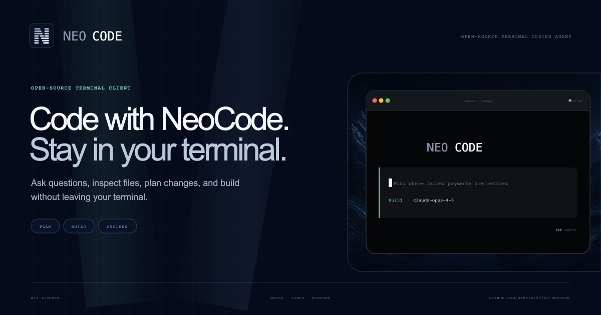

<p align="center">
  
</p>

<p align="center">
  <a href="https://github.com/Hardik180704/NeoCode/releases">Releases</a>
  ·
  <a href="./docs/RELEASING.md">Release Guide</a>
  ·
  <a href="./CONTRIBUTING.md">Contributing</a>
  ·
  <a href="./packages/web">Landing Page</a>
</p>

# NeoCode

NeoCode is an open-source, terminal-native coding agent. It gives you streaming
AI responses, persistent sessions, PLAN and BUILD modes, local repository tools,
NeoLens codebase intelligence, themes, and optional Model Context Protocol (MCP)
integrations without pulling you out of the terminal.

It is built as a Bun monorepo with a terminal client, API server, shared package,
database package, and a Vite-powered landing page.

## Highlights

- Terminal-first coding workflow with a focused OpenTUI interface.
- PLAN mode for read-only investigation and BUILD mode for implementation.
- Persistent sessions that can be reopened from `/sessions`.
- Model selection, agent switching, login, and themes from the command menu.
- NeoLens for tracking file activity and dependency context while an agent works.
- MCP server discovery through project-local `.neocode/mcp.json`.
- GitHub Releases for standalone binaries on macOS, Linux, and Windows.
- Homebrew support for macOS and Linux installs.
- Static landing page in `packages/web`.

## Install

### Homebrew

```sh
brew install Hardik180704/tap/neocode
```

### macOS and Linux

```sh
curl -fsSL https://raw.githubusercontent.com/Hardik180704/NeoCode/main/install.sh | sh
```

Alpine Linux users must install the C++ runtime libraries first:

```sh
apk add --no-cache libstdc++ libgcc
```

### Windows PowerShell

```powershell
irm https://raw.githubusercontent.com/Hardik180704/NeoCode/main/install.ps1 | iex
```

Standalone binaries are also available from
[GitHub Releases](https://github.com/Hardik180704/NeoCode/releases). They include
the Bun runtime, so users do not need to install Bun or Node.js to run NeoCode.

Current binaries are unsigned. macOS may require manual approval in Privacy &
Security, and Windows may display a Microsoft Defender SmartScreen warning.
Published SHA-256 checksums and GitHub attestations can be used to verify each
download.

## Usage

Start NeoCode from inside any project directory:

```sh
cd path/to/project
neocode
```

Common commands:

| Command | Purpose |
| --- | --- |
| `/new` | Start a new conversation |
| `/agents` | Switch between PLAN and BUILD agents |
| `/models` | Select the AI model |
| `/sessions` | Browse previous sessions |
| `/lens` | Open NeoLens activity and dependency context |
| `/mcp` | Inspect configured MCP servers and tool access |
| `/theme` | Change the terminal theme |
| `/login` | Sign in through the browser |

Use `API_URL` to point the CLI at a different NeoCode API during development:

```sh
API_URL=http://localhost:3000 neocode
```

## NeoLens

NeoLens helps make agent activity inspectable. During a session it tracks file
reads, edits, checks, failures, and dependency relationships so you can understand
what changed and why.

Open it from an active session with:

```text
/lens
```

NeoLens is intentionally project-scoped. Start NeoCode inside a real repository
so dependency graphing and file activity can be resolved safely.

## MCP Integrations

NeoCode discovers MCP servers from `.neocode/mcp.json` in the active project.
MCP is optional; without it, NeoCode's built-in local tools continue to work.

Start from the included example:

```sh
mkdir -p .neocode
cp .neocode/mcp.example.json .neocode/mcp.json
```

Every MCP tool is denied by default and must have an explicit access policy:

| Policy | Availability |
| --- | --- |
| `read` | Available in PLAN and BUILD modes |
| `write` | Available only in BUILD mode |
| `disabled` | Never exposed to the model |

The special `"*"` policy can classify every otherwise-unlisted tool from a
server, but explicit per-tool policies are recommended.

Secrets should use environment references such as `${env:GITHUB_TOKEN}`.
Resolved secret values stay in the server process and are not returned by the MCP
inspection API. Local stdio servers receive only a small safe set of inherited
process variables plus variables declared in their own `env` block.

Supported transports:

- `stdio` for local MCP server processes.
- Streamable HTTP for remote MCP servers.

MCP clients are scoped to a response or inspection request and always closed
after completion, failure, or interruption.

## Repository Layout

| Path | Purpose |
| --- | --- |
| `packages/cli` | Terminal UI and `neocode` command |
| `packages/server` | API, auth, chat routes, billing hooks, MCP runtime, NeoLens routes |
| `packages/shared` | Shared schemas, model metadata, and NeoLens graph types |
| `packages/database` | Prisma schema, generated client, and database adapter |
| `packages/web` | Vite React landing page |
| `scripts` | Release, packaging, Homebrew, and smoke-test scripts |
| `docs` | Release and operational documentation |

## Development

Install dependencies:

```sh
bun install
```

Run the API server:

```sh
bun run dev:server
```

Run the terminal client:

```sh
bun run dev:cli
```

Run the landing page:

```sh
bun run dev:web
```

Build the landing page:

```sh
bun run build:web
```

Run tests:

```sh
bun test
```

## Releases

NeoCode releases publish standalone CLI archives for macOS, Linux, and Windows
through GitHub Releases. Homebrew formula updates are handled through the
configured tap repository.

See [docs/RELEASING.md](./docs/RELEASING.md) for the full release and Homebrew
process.

## Contributing

Contributions are welcome. Please read
[CONTRIBUTING.md](./CONTRIBUTING.md) before opening a pull request.

## License

NeoCode is released under the [MIT License](./LICENSE).
